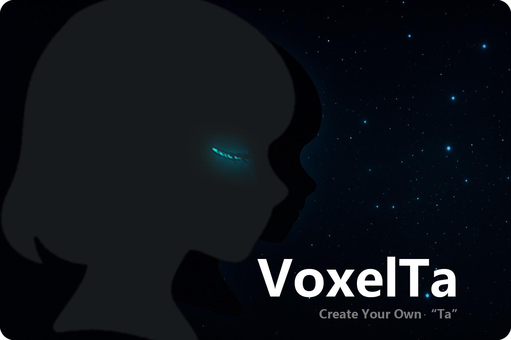

<p align="center">
  
</p>

<h1 align="center">VoxelTa</h1>

<div align="center">

中文版 | [English](README.md)

一个基于 Unity 开发的桌面虚拟聊天伴侣项目，创造你心目中的Ta。

</div>

## ⭐项目特色

- 可以导入任意 Live2d 虚拟角色
- 可自定义的角色表情，并根据对话更改
- 智能对话系统
- 桌面伴侣模式
- 支持本地文字转语音
- 目前仅支持windows

## 如何使用

### 普通用户 - 直接使用软件
如果你只是想体验这个桌面伴侣，无需安装 Unity 和各种依赖：

**[点击此处下载最新版本](https://github.com/HXDBK/VoxelTa/releases)**

下载后解压即可直接运行！

## 🚀快速开始

### 1. 运行VoxelTa

下载好后请先解压文件夹，双击解压后的文件夹中的 **VoxelTa.exe** 运行软件
### 2. 创建你的第一个人物

[](Images/pic0.png)

如果你是第一次进入VoxelTa，会弹出这样的界面，你可以在这个界面选择你使用的语言，并点击 **创建人物** 按钮来创建你的第一个人物。

[](Images/pic1.png)

人物界面主要分为3个部分，最左侧是人物对话选择部分，在VoxelTa中，你可以创建多个角色，通过左侧的列表，你可以**创建新角色** ，**导出角色**，**导入角色**，**复制角色**和**删除角色**，在左侧角色列表选择一个角色之后，你可以开始对这个角色进行设置（标\*为必填项）
#### 人物设定
**对话标题**：用于展示在左侧人物列表。  
**人物头像**：显示在对话列表中的展示的头像。  
**角色名称**：显示在对话列表中的角色名称。  
**用户名称**：显示在对话列表中的用户名称。  
**角色设定\***：【重要】这个角色的设定，包括姓名、年龄、性别等基础信息，背景设定，回复规则等，这里填写的数据决定了你的角色是谁。  
**记忆**：该角色的长久记忆（填写在这里和直接填写在**角色设定**中效果上没有什么差别，填写在这里主要是方便管理）。  
#### 立绘设置
如果你还没有为当前角色设置Live2d模型，点击该区域可以为你的角色选择一个Live2d模型，你需要选择Live2d文件中的以.model3.json结尾的文件，没有问题的话，你的Live2d模型会被加载出来。

[](Images/pic2.png)

点击右上角保存按钮并关闭人物设定页面  
在Live2d模型设置完成后立绘区域的右上方会出现新的按钮，后续点击**齿轮**按钮可以对Live2d进行进一步的设置，详情见[立绘设置和自定义表情](#立绘设置和自定义表情)。
### 3.设置大语言模型
点击屏幕右上角的**齿轮**图标可以打开对话设置界面

[](Images/pic3.png)

想要和你的”Ta“对话的话，需要为角色设置大语言模型，在界面的左侧一列可以设置使用的模型：  
**模型选择**：VoxelTa提供了一些默认的模型配置（DeepSeek，ChartGPT，Gemini）你也可以选择自定义来配置其他的第三方模型。  
**APIUrl**：选择自定义时才需要设置，调用接口的地址。  
**模型名称**：同一个大模型会有不同版本的模型，例如DeepSeek拥有deepseek-chat和deepseek-reasoner两种模型，具体不同的模型之间的区别需要查看该模型的官网。  
**规则名称**：选择自定义时才需要设置，发送系统规则时的名称。  
**APIKey**：（重要）这个输入框需要输入你得到的该模型的调用API。  
**最大字符数**：限制最大上下文字符数数量，超过该字符数的对话将会被剪裁。  

设置完成后请点击右上角保存按钮并关闭对话设置页面  
其他设置界面如果有需要请查看  
[设置背景图片](#设置背景图片)  
[使用文字转语音](#使用文字转语音)
### 4.对话

[](Images/pic4.png)

回到对话界面后，你就可以尝试发送你的第一条消息了。  
对话界面下有三种模式  
**仅对话**：只展示对话文字。  
**人物对话**：展示角色，对话文字在左侧展示，在角色人物上拖动可以改变角色位置，滚动滚轮可以改变角色人物大小。  
**桌面模式**：橘色展示为浮窗形式，在角色人物上拖动可以改变角色位置，滚动滚轮可以改变角色人物大小，在角色人物上按住右键可以唤出菜单。  
### 立绘设置和自定义表情

[](Images/pic5.png)

**模型参数调整**：在界面左侧将会展示你的Live2d模型的所有参数，可以直接调整这里的参数修改Live2d模型的外观。  
**模型自动行为**：你可以打开或关闭模型的一些自动行为，包括呼吸、眨眼和鼠标跟随。  
**模型表情**：界面最右侧展示了该模型所拥有的所有表情（一些模型会附带一些表情）。  
**自定义表情**：你可以通过界面右上方的 **\+** 按钮来添加你的自定义表情。  

[](Images/pic6.png)

自定义表情有如下设置：  
**表情识别标识\***：当角色的回复中出现该标识的时候，角色将会做出这个表情，直到下一句回复（支持正则）。  
**表情名称\***：展示在表情列表中的名称。  
**淡入时长**：播放该表情时的淡入时长。  
**淡出时长**：播放该表情时的淡出时长。  
**表情参数列表\***：在你打开自定义表情界面之后，最左侧的参数列表中的每个参数右上角都出现了 **\+** 号，调整任意参数后点击 **\+** 号即可把该参数添加到自定义表情中。  
在设置完成之后，点击**保存表情**即可保存自定义表情  
### 设置背景图片
在设置界面，你可以设置对话的背景界面（桌面模式下不会显示背景）  
**选择图片**：选择一张本地图片作为背景图片。  
**按住下方按钮拖动背景**：通过按住这个按钮并拖动可以设置背景位置。  
**按住下方按钮缩放背景**：通过按住这个按钮并拖动可以设置背景大小。  
**背景颜色**：可以设置纯色背景的颜色。  
**背景光**：可以设置人物的颜色，用于让人物和背景更加融合。  
**Ta的名字颜色**：对话界面中，角色的名称颜色。  
### 使用文字转语音
目前VoxelTa的文字转语音仅支持[GPT-SoVITS](https://github.com/RVC-Boss/GPT-SoVITS) 的本地API调用。  
**语音模块API**：[GPT-SoVITS](https://github.com/RVC-Boss/GPT-SoVITS) 的本地API地址。  
**参考语音文件地址**：生成时参考音频的文件地址，可以直接点击右侧**文件夹**图标进行选择。  
**参考语音文本**：参考语音的文本参考。  
**桌面模式是否显示气泡**：桌面模式下如果你只想听声音的话，可以取消勾选。  

---

### 开发者 - 源码开发
如果你想修改项目或参与开发，请按照下面的完整步骤：

## 环境要求

- **Unity 版本**：2022.3.x LTS
- **支持平台**：
  - Windows（完整功能，包括桌面模式）
  
## 依赖插件

本项目依赖以下第三方插件，需要你手动下载并导入：

### 必需插件

| 插件名称 | 类型 | 获取方式 |
|---------|------|----------|
| [DOTween](https://dotween.demigiant.com/) | 免费 | Unity Asset Store |
| [Easy Save 3](https://assetstore.unity.com/packages/tools/utilities/easy-save-the-complete-save-data-serialization-asset-768) | 付费 | Unity Asset Store |

> **重要提醒**：这些插件不会包含在仓库中，请在克隆项目后自行下载并导入。

## 导入项目

### 1. 获取项目代码
```bash
git clone https://github.com/HXDBK/VoxelTa.git
cd VoxelTa
```

### 2. 打开项目
使用 Unity 2022.3.x LTS 打开项目文件夹

### 3. 导入依赖插件

#### DOTween 设置
1. 从 Unity Asset Store 下载并导入 DOTween
2. 在 Unity 菜单中执行以下步骤：
   ```
   Tools → Demigiant → DOTween Utility Panel → Setup DOTween
   ```
3. 按照面板提示完成设置

#### Easy Save 3 设置
1. 从 Unity Asset Store 购买并导入 Easy Save 3
2. 等待 Unity 自动完成编译

### 4. 运行项目
1. 等待所有依赖编译完成
2. 进入 Scene Main 场景
3. 点击 Unity 编辑器中的 **Play** 按钮

## 未来功能

- [ ] 第三方在线语音转文字支持
- [ ] 语音转文字支持
- [ ] 自定义动画支持
- [ ] 当前桌面识别支持

## 开源协议

- **项目代码**：[MIT License](LICENSE)
- **第三方插件**：请遵循各自的许可证要求

## 第三方声明

本项目使用了多个第三方库和插件，详细的许可信息请查看 [ThirdPartyNotices.md](ThirdPartyNotices.md)。